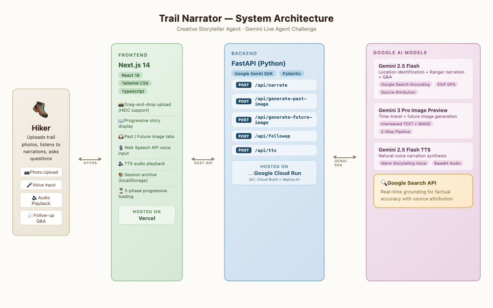

# 🏔️ Trail Narrator

**An AI-powered national parks storytelling agent that transforms your trail photos into immersive geological time-travel experiences.**

> Built for the [Gemini Live Agent Challenge](https://geminiliveagentchallenge.devpost.com/) — Creative Storyteller Track

## What It Does

Upload a photo from your hike, and Trail Narrator's AI park ranger "Ranger" will:

1. **See** your photo — identifying geological formations, rock types, flora, and fauna
2. **Narrate** the deep story — not just facts, but millions of years of geological history told as a compelling narrative
3. **Create** a time-travel visualization — an AI-generated image showing what that exact landscape looked like millions of years ago
4. **Respond** to your questions — ask follow-ups like "What kind of rock is that?" or "What animals lived here?"

Upload multiple photos from the same trail, and Ranger weaves them into a **continuous story** — connecting the geological narrative across your entire hike.

## Demo

[📹 Watch the Demo Video (< 4 min)](link-here)

## Architecture



```
Frontend (Next.js + Tailwind CSS)
  ↓ REST API + WebSocket
Backend (FastAPI on Google Cloud Run)
  ├── Gemini 2.5 Flash → Image analysis + Narration generation
  ├── Gemini 3 Pro Image → Time-travel image generation (interleaved output)
  ├── Gemini Live API → Voice interaction for follow-up questions
  ├── Firestore → Session management
  └── Cloud Storage → Media cache
```

## Tech Stack

| Component | Technology |
|-----------|-----------|
| Backend | Python 3.11, FastAPI, Google GenAI SDK |
| Frontend | Next.js 14, React 18, Tailwind CSS |
| AI Models | Gemini 2.5 Flash, Gemini 3 Pro Image, Gemini Live API |
| Cloud | Google Cloud Run, Firestore, Cloud Storage |
| IaC | gcloud deployment scripts |

## Quick Start

### Prerequisites
- Python 3.11+
- Node.js 18+
- A [Gemini API key](https://aistudio.google.com/app/apikey) or Google Cloud project with Vertex AI enabled

### Backend Setup
```bash
cd backend
pip install -r requirements.txt

# Set your API key
export GEMINI_API_KEY=your-key-here

# Run the server
uvicorn main:app --reload --port 8000
```

### Frontend Setup
```bash
cd frontend
npm install
npm run dev
```

### Test the API
```bash
# Upload a trail photo
curl -X POST http://localhost:8000/api/narrate \
  -F "image=@your_trail_photo.jpg"

# Ask a follow-up question
curl -X POST http://localhost:8000/api/followup \
  -H "Content-Type: application/json" \
  -d '{"session_id": "your-session-id", "question": "What kind of rock is that?"}'
```

### Deploy to Google Cloud
```bash
export GOOGLE_CLOUD_PROJECT=your-project-id
cd infra
chmod +x deploy.sh
./deploy.sh
```

## Google Cloud Services Used
- **Cloud Run** — Serverless backend hosting
- **Firestore** — Session and trail data storage
- **Cloud Storage** — Generated media caching
- **Vertex AI** — Gemini model access in production

## Hackathon Details

- **Track:** Creative Storyteller
- **Challenge:** Gemini Live Agent Challenge
- **Mandatory Tech:** Gemini interleaved/mixed output, Google GenAI SDK, Google Cloud hosting

## License

MIT

---

*Created for the Gemini Live Agent Challenge hackathon. #GeminiLiveAgentChallenge*
