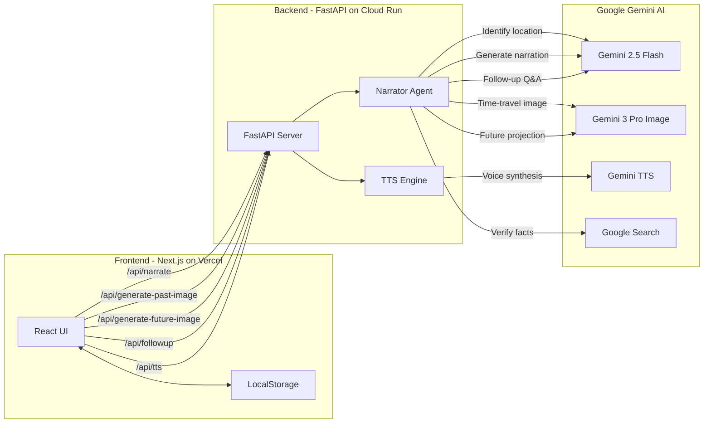
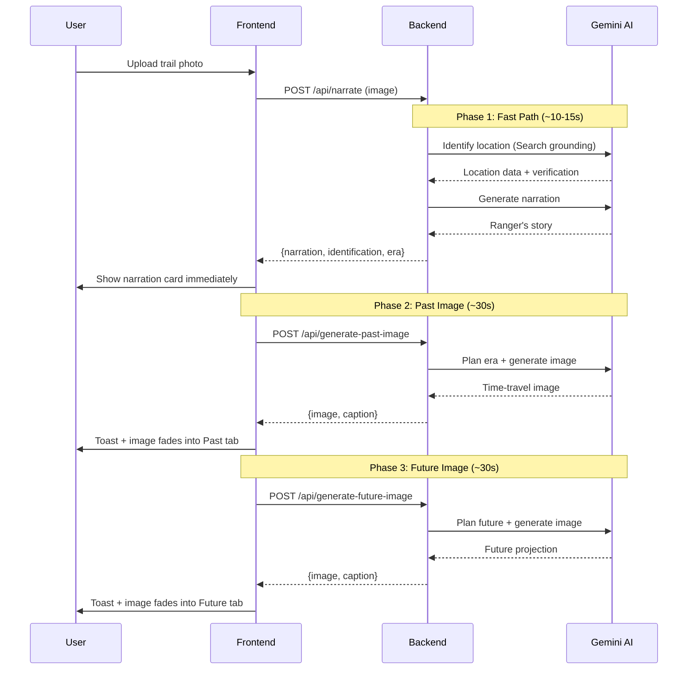

# Trail Narrator

**An AI-powered national parks storytelling agent that transforms your trail photos into immersive geological time-travel experiences.**

> Built for the [Gemini Live Agent Challenge](https://geminiliveagentchallenge.devpost.com/) — Creative Storyteller Track

**[Live Demo](https://trailnarrator.com)** | **[Backend API](https://trail-narrator-api-874437218899.us-central1.run.app)**

---

## What It Does

Upload a photo from your hike, and Trail Narrator's AI park ranger **"Ranger"** will:

1. **Identify** your landscape — geological formations, rock types, flora, fauna, and era using Google Search grounding for verified accuracy
2. **Narrate** the deep story — millions of years of geological history told as a compelling campfire narrative (not a dry textbook)
3. **Visualize the past** — an AI-generated image showing what that exact landscape looked like in its most dramatic geological era
4. **Project the future** — a scientifically grounded visualization of how climate and geology will reshape the scene
5. **Speak** the narration — natural voice synthesis brings Ranger's story to life
6. **Answer** your questions — ask follow-ups like "What kind of rock is that?" with chatbot-style instant responses

Upload multiple photos from the same trail, and Ranger weaves them into a **continuous story** — connecting the geological narrative across your entire hike.

## Architecture




### Progressive Narration Flow

The app uses a **3-phase progressive pipeline** so you see results immediately instead of waiting 2+ minutes:



## Tech Stack

| Layer | Technology | Purpose |
|-------|-----------|---------|
| **Frontend** | Next.js 14, React 18, Tailwind CSS, TypeScript | Responsive UI with progressive loading |
| **Backend** | Python 3.11, FastAPI, Pydantic | REST API with async Gemini calls |
| **AI — Text** | Gemini 2.5 Flash + Google Search Grounding | Location ID, narration, Q&A |
| **AI — Image** | Gemini 3 Pro Image Preview | Interleaved text + image generation |
| **AI — Voice** | Gemini 2.5 Flash TTS | Natural voice narration synthesis |
| **Hosting** | Google Cloud Run (backend), Vercel (frontend) | Serverless, auto-scaling |
| **IaC** | gcloud deploy scripts | Automated Cloud Run deployment |

## Key Features

- **Google Search Grounding** — Ranger doesn't guess. Location identification is verified against Google Search for accuracy, with grounding sources logged.
- **Interleaved Multimodal Output** — Time-travel and future images use Gemini's interleaved `TEXT + IMAGE` response modality for rich mixed-media generation.
- **Progressive Reveal** — Narration appears in ~10s; images generate in the background and pop in with toast notifications.
- **EXIF GPS Extraction** — When photos contain GPS coordinates, Ranger uses them to pinpoint the exact location.
- **HEIC/HEIF Support** — Native iPhone photo format support with automatic conversion.
- **Session Continuity** — Upload multiple trail photos and Ranger weaves a connected story across your hike.
- **Voice Interaction** — Ask follow-up questions by voice (Web Speech API) and hear Ranger's narration (Gemini TTS).
- **Chatbot-Style Q&A** — Questions appear instantly with typing indicators; answers stream in naturally.

## Project Structure

```
trail-narrator/
├── backend/
│   ├── main.py                  # FastAPI app — 7 endpoints
│   ├── agents/
│   │   └── narrator.py          # Core AI pipeline (identify → narrate → image gen)
│   ├── Dockerfile               # Python 3.11 slim container
│   └── requirements.txt
├── frontend/
│   ├── app/
│   │   ├── page.tsx             # Main React component (progressive narration UI)
│   │   ├── layout.tsx           # Root layout with Google Fonts
│   │   └── globals.css          # Custom animations and styling
│   ├── tailwind.config.ts
│   └── package.json
├── infra/
│   └── deploy.sh                # Cloud Run deployment automation
├── CLAUDE.md                    # AI agent instructions
└── README.md
```

## API Endpoints

| Endpoint | Method | Description | Response Time |
|----------|--------|-------------|---------------|
| `/api/narrate` | POST | Upload photo → get narration + identification | ~10-15s |
| `/api/generate-past-image` | POST | Generate time-travel past image | ~30-60s |
| `/api/generate-future-image` | POST | Generate future projection image | ~30-60s |
| `/api/followup` | POST | Ask Ranger a follow-up question | ~3-5s |
| `/api/tts` | POST | Convert narration text to speech | ~5-10s |
| `/health` | GET | Health check | instant |

## Quick Start

### Prerequisites
- Python 3.11+
- Node.js 18+
- A [Gemini API key](https://aistudio.google.com/app/apikey)

### Backend

```bash
cd backend
pip install -r requirements.txt
export GEMINI_API_KEY=your-key-here
uvicorn main:app --reload --port 8000
```

### Frontend

```bash
cd frontend
npm install

# For local development (pointing to local backend):
echo "NEXT_PUBLIC_API_URL=http://localhost:8000" > .env.local
npm run dev
```

Open [http://localhost:3000](http://localhost:3000) and upload a trail photo.

### Test the API Directly

```bash
# Upload a trail photo and get narration
curl -X POST http://localhost:8000/api/narrate \
  -F "image=@your_trail_photo.jpg"

# Generate time-travel past image
curl -X POST http://localhost:8000/api/generate-past-image \
  -H "Content-Type: application/json" \
  -d '{"session_id":"your-session-id","narration":"...","identification":"..."}'

# Ask a follow-up question
curl -X POST http://localhost:8000/api/followup \
  -H "Content-Type: application/json" \
  -d '{"session_id":"your-session-id","question":"What kind of rock is that?"}'
```

## Deploy to Google Cloud

### Backend (Cloud Run)

```bash
cd backend
gcloud run deploy trail-narrator-api \
  --source . \
  --region us-central1 \
  --allow-unauthenticated \
  --set-env-vars="GEMINI_API_KEY=your-key" \
  --timeout=300 \
  --memory=1Gi
```

### Frontend (Vercel)

```bash
cd frontend
vercel --prod
vercel env add NEXT_PUBLIC_API_URL production
# Enter: https://your-cloud-run-url
vercel --prod  # Redeploy with env var
```

### Automated Deployment

```bash
cd infra
chmod +x deploy.sh
./deploy.sh
```

## Google Cloud Services Used

- **Cloud Run** — Serverless backend hosting with auto-scaling (0-10 instances)
- **Cloud Build** — Container image building from source
- **Artifact Registry** — Container image storage
- **Gemini API** — AI model access (Flash, Pro Image, TTS)

## Gemini Models & Features Used

| Model | Feature | Usage |
|-------|---------|-------|
| `gemini-2.5-flash` | Text generation + Google Search grounding | Location identification with verified sources |
| `gemini-2.5-flash` | Text generation | Narration writing, follow-up Q&A |
| `gemini-3-pro-image-preview` | **Interleaved TEXT + IMAGE output** | Time-travel and future image generation |
| `gemini-2.5-flash-preview-tts` | Text-to-speech | Natural voice narration |

## Hackathon Details

- **Hackathon:** Gemini Live Agent Challenge
- **Track:** Creative Storyteller
- **Mandatory Tech:** Gemini interleaved/mixed output, Google GenAI SDK, Google Cloud hosting

## License

MIT

---

*Built with Gemini AI for the Gemini Live Agent Challenge. #GeminiLiveAgentChallenge*
